# Psoriasis Biomarker Discovery with Interpretable Machine Learning

**Finding candidate disease genes by requiring statistics, model stability and explainable ML to agree.**


MSc Data Science dissertation, University of Sheffield (2026) · Author: **Cailey Coghlan**

📄 [Read the full dissertation (PDF)](docs/dissertation.pdf)

---

## Project summary

### The problem
Psoriasis is a common, chronic skin disease driven by the immune system, and it changes the activity of thousands of genes. Machine learning is often used to find "biomarker" genes that could help diagnose or understand it. Most studies, though, search only a pre-chosen family of genes and trust the explanation of a single model. That makes it hard to tell a real biological signal from the quirks of one algorithm.

### What I did
I analysed a public RNA-sequencing dataset of **174 skin samples** (92 psoriatic, 82 normal) covering **21,510 genes**, using R. Instead of trusting any single method, I required **three independent lines of evidence to agree** before calling a gene a candidate:

1. **Statistics.** The gene is significantly more or less active in psoriatic skin (differential expression with limma, corrected for testing thousands of genes at once).
2. **Stability.** The gene is chosen by an elastic-net model in **every one** of five cross-validation rounds, so the selection isn't a fluke of one data split.
3. **Model importance.** The gene ranks in the top 10 of at least one of three different machine-learning models (XGBoost, random forest, support vector machine), measured with SHAP explainability.

The pipeline was designed to prevent **data leakage**. Gene selection and model tuning happened inside each cross-validation fold, and 34 samples were locked away until the final test.

### What I found
- **1,131 genes** were significantly changed in psoriasis, recovering the disease's well-known signature (e.g. *DEFB4A*, *S100A8/9*, *PI3*).
- All three models told psoriatic and normal skin apart **without error**, on both cross-validation and the held-out test set. However, they **disagreed strongly on which genes mattered**, which shows why one model's explanation can't be taken at face value.
- **14 genes passed all three tests.** Eight are already linked to psoriasis, which suggests the method finds real biology. **Six have no recorded link to psoriasis** and are potential new leads.
- The standout is **ABCG4**, the only gene ranked in the top 10 by all three models. Its known associations are with prostate cancer and Alzheimer's disease, not skin.

### Why it matters
The candidates are well supported within this cohort but need validating in independent patient groups and in the lab before any causal role can be claimed. **Should they be validated, they could support both a clearer understanding of psoriasis mechanisms and the search for new therapeutic targets.** The six novel genes are especially interesting because single-model, category-restricted approaches would have missed them.

Beyond psoriasis, the study's main contribution is a **transferable framework** for prioritising biomarkers from high-dimensional expression data. It requires different methods to agree before trusting a result, and the same approach applies anywhere you need to explain *why* a model works, not just *that* it works.

---

## Key results

| | |
|---|---|
| Samples | 174 (92 psoriatic, 82 normal) |
| Genes analysed | 21,099 expressed → 17,656 after variance filtering → **64-gene panel** |
| Differentially expressed genes | **1,131** (489 up, 642 down; FDR < 0.05, \|log2FC\| > 1) |
| Genes stable across all 5 CV folds | 30 |
| Classification (nested CV and held-out test) | AUC = 1.000 for all three models (see [*Why perfect accuracy?*](#a-note-on-perfect-accuracy)) |
| Candidate biomarkers | **14** (8 known, 6 novel) |

<p align="center">
  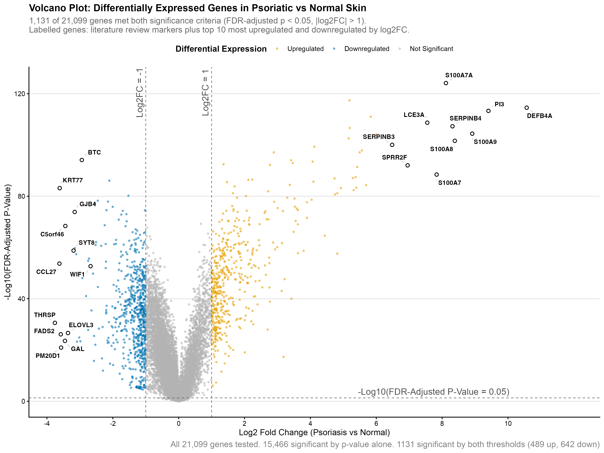
</p>

### The 14 candidates

| Gene | Direction | log2FC | RF rank | XGB rank | SVM rank | Known psoriasis link? |
|---|---|---|---|---|---|---|
| **ABCG4** | Up | 1.65 | 3 | **1** | 9 | **No (novel)** |
| S100A8 | Up | 8.38 | 2 | n/a | 44 | Yes |
| S100A12 | Up | 5.83 | 8 | n/a | 42 | Yes |
| IL1F9 (IL36G) | Up | 5.20 | 7 | n/a | 45 | Yes |
| AKR1B10 | Up | 5.19 | 17 | 2 | 48 | Yes |
| FABP5 | Up | 3.41 | 5 | n/a | 46 | Yes |
| GDA | Up | 2.90 | 45 | n/a | 4 | Yes (weak) |
| **AKR1B15** | Up | 2.89 | 14 | 3 | 31 | **No (novel)** |
| VNN3 | Up | 2.23 | **1** | n/a | 26 | Yes |
| **COBL** | Down | −1.53 | 13 | 5 | 47 | **No (novel)** |
| **TPBG** | Up | 1.47 | 4 | n/a | 15 | **No (novel)** |
| **CDK5R1** | Up | 1.36 | 16 | 6 | 40 | **No (novel)** |
| TAP2 | Up | 1.13 | 48 | n/a | 6 | Yes |
| **HOXC10** | Down | −1.05 | 56 | n/a | 2 | **No (novel)** |

*n/a: XGBoost gave non-zero importance to only 7 of the 64 genes. Psoriasis links come from DISGENET.*

---

## Pipeline

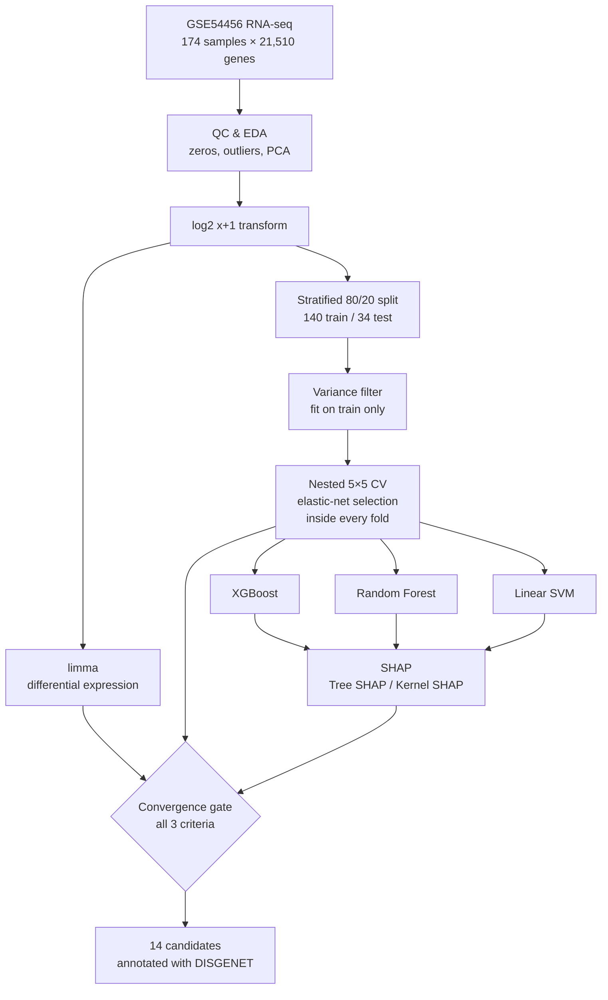

### Design decisions that matter

- **No data leakage.** Feature selection, scaling and hyperparameter tuning are all refit *inside* each outer fold. The variance filter is learned on training data only, and the 34-sample test set stays untouched until the final evaluation.
- **A fair model comparison.** All three models share the same outer folds and the same elastic-net gene selection (fixed seed). Any difference in their rankings therefore comes from the algorithm, not from the data split.
- **Each model gets the input it suits.** Tree models receive untransformed RPKM because they are scale-invariant. The SVM and elastic net receive log2 data, standardised within each fold.
- **The right SHAP method for each model.** Exact Tree SHAP is used for XGBoost and Random Forest. Kernel SHAP is used for the SVM, with its non-convergence measured and reported rather than hidden: direction checks gave |r| ≥ 0.97 for every top-10 gene.
- **Choices are justified with evidence.** The elastic-net α = 0.8 was picked from a diagnostic sweep: 64 genes vs 384 at the CV-optimal α, for a CV-error cost of only 0.003. The variance threshold is backed by a histogram.

<details>
<summary><b>Nested cross-validation, step by step</b></summary>
<p align="center">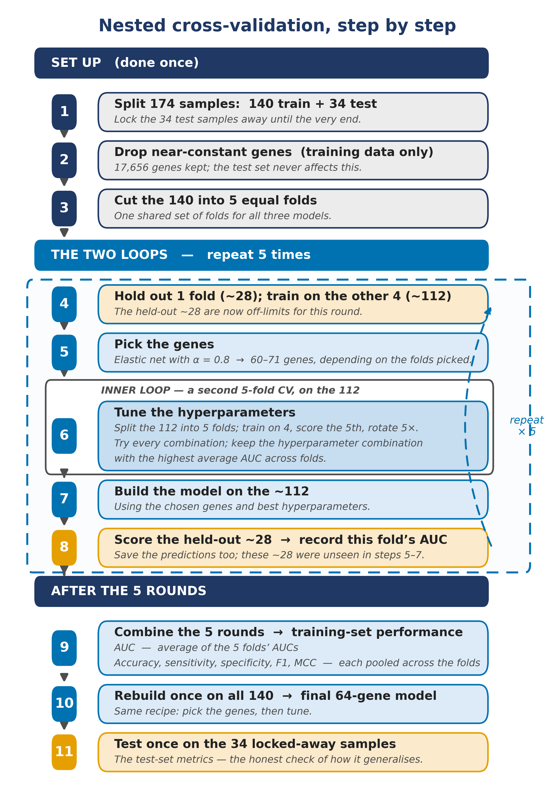</p>
</details>

---

## Model explainability (SHAP)

The three models agreed on accuracy but **disagreed sharply on which genes mattered**. That is the reason for requiring convergence: one model's feature importance alone is not reliable evidence.

| XGBoost | Random Forest | SVM |
|---|---|---|
| 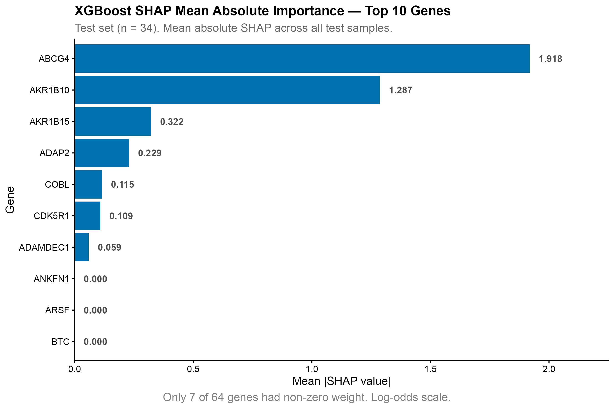 | 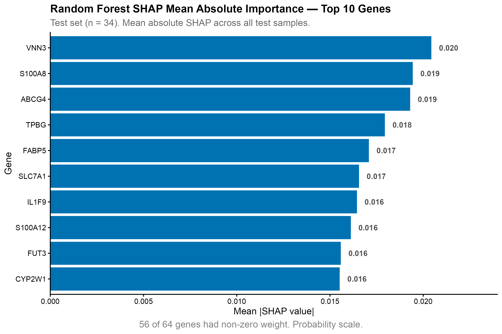 | 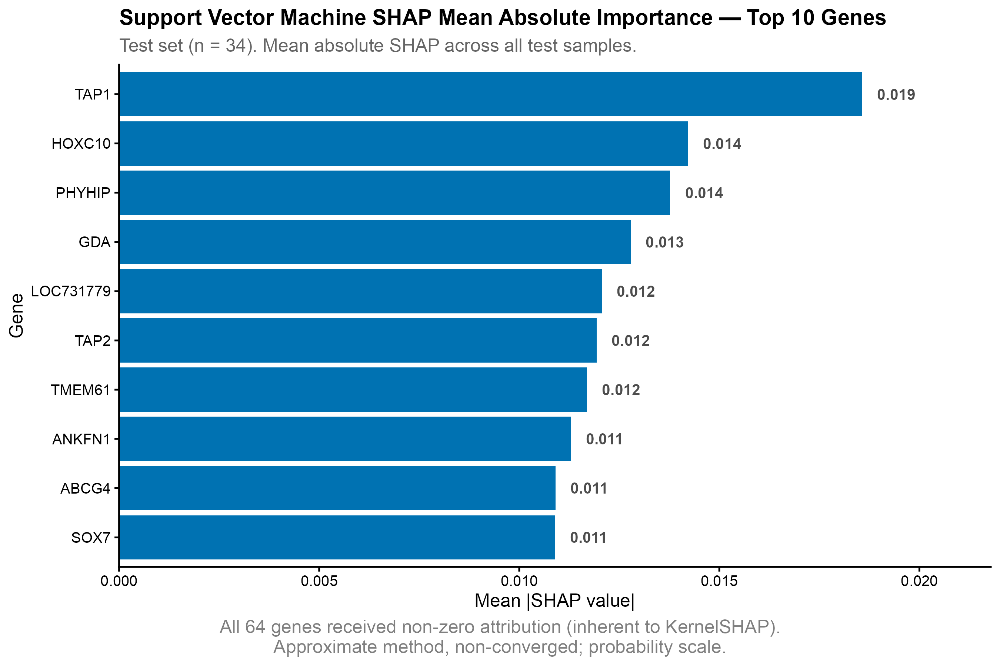 |

<details>
<summary>More figures (EDA, PCA, ROC curves, beeswarm plots)</summary>
<br>
<table>
  <tr>
    <td>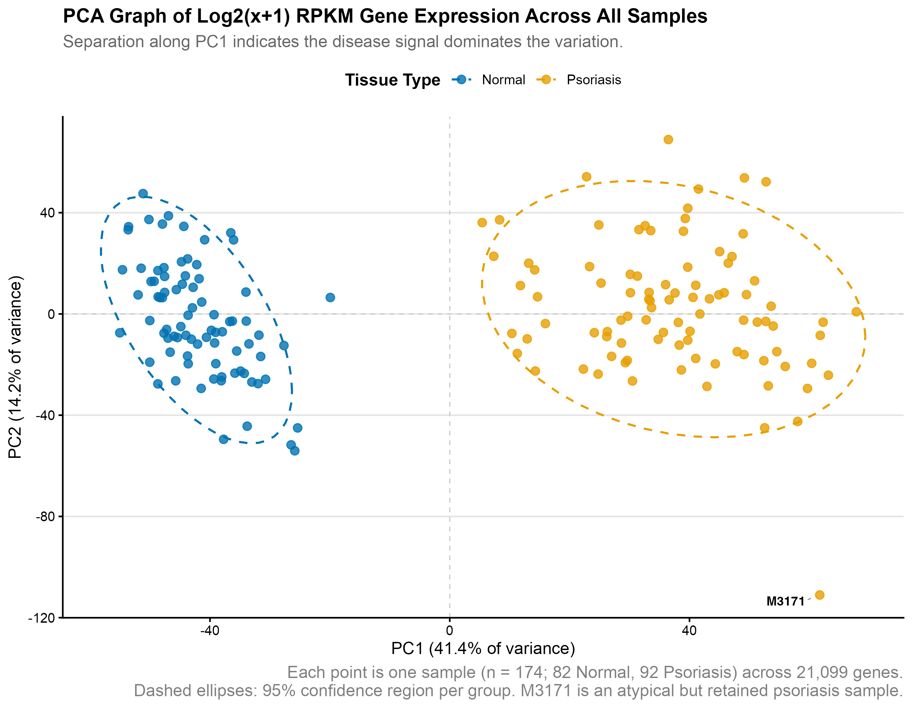</td>
    <td>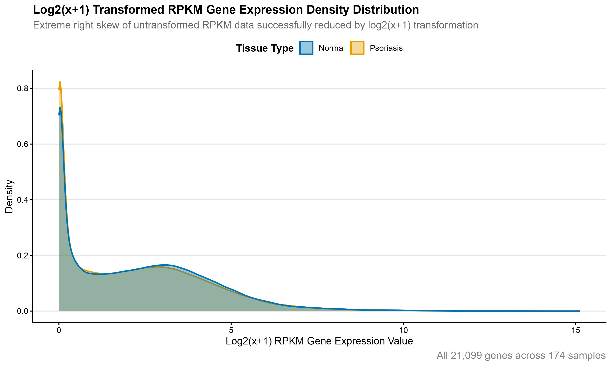</td>
  </tr>
  <tr>
    <td>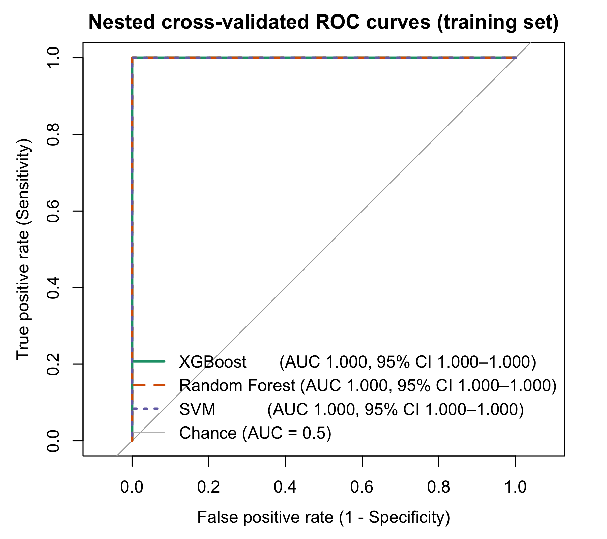</td>
    <td>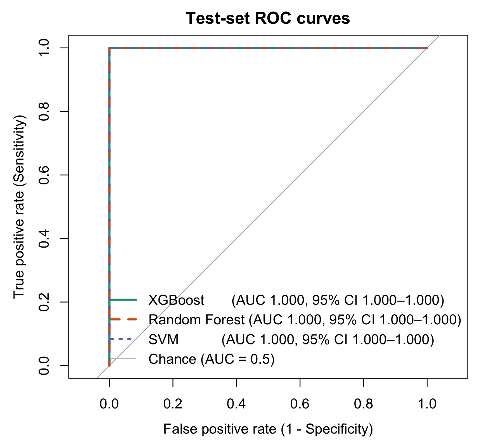</td>
  </tr>
  <tr>
    <td>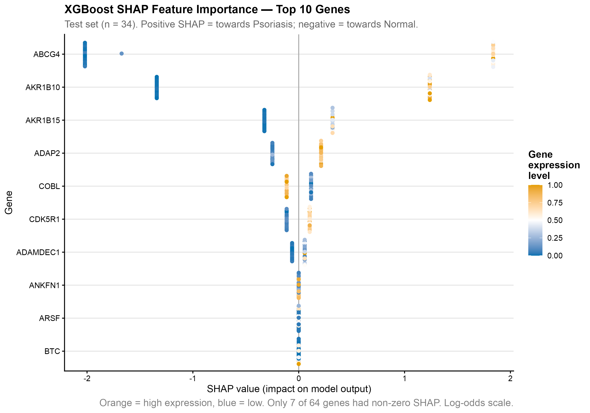</td>
    <td>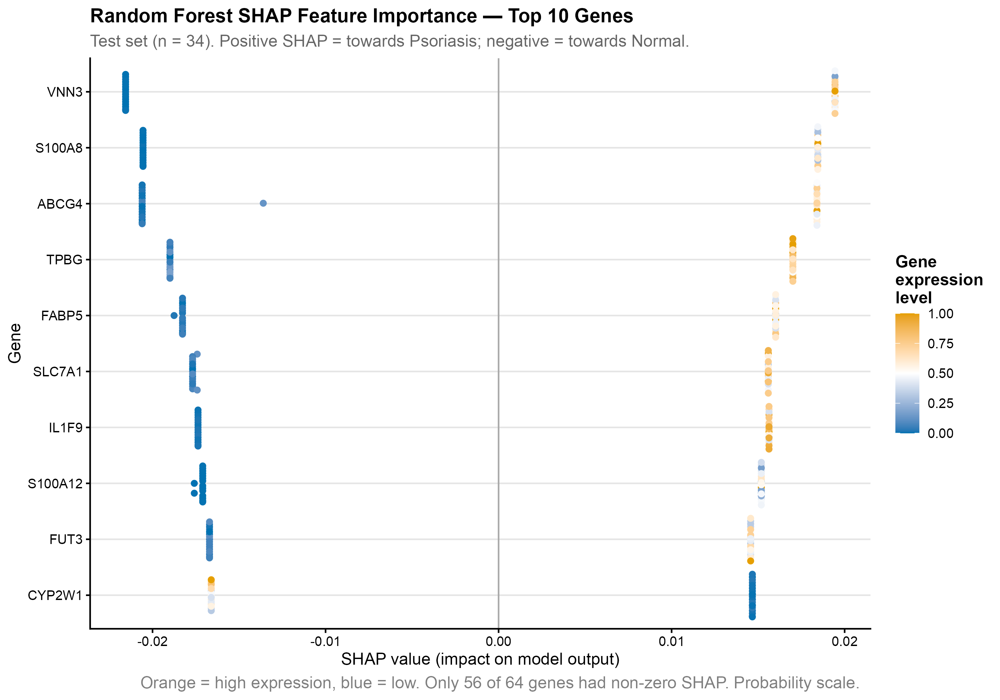</td>
  </tr>
  <tr>
    <td>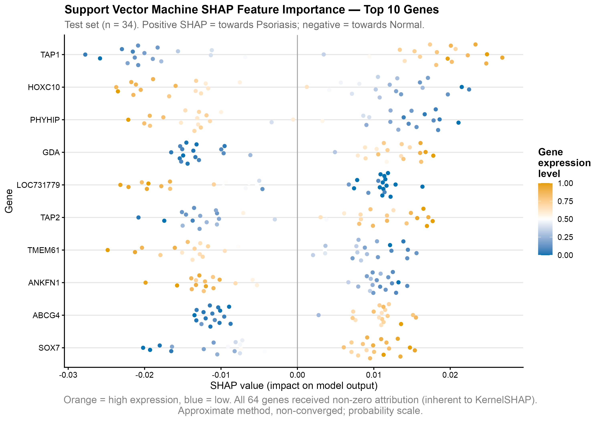</td>
    <td>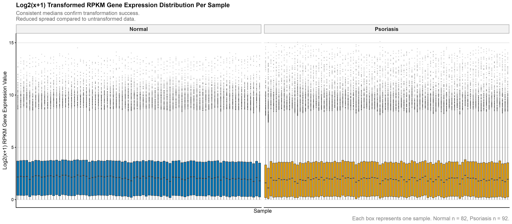</td>
  </tr>
</table>
</details>

---

## A note on perfect accuracy

All three models reached AUC = 1.000. That result deserves suspicion, so here is why it holds up and why it is **not** the headline:

1. **The classes really do separate.** PCA on the unsupervised data already splits psoriatic from normal skin along PC1, before any model is trained. Other studies on this cohort report the same separability.
2. **Leakage was ruled out by design.** Every data-dependent step sits inside the CV folds, and performance on the untouched test set matches CV performance.
3. **Classification was a means, not the goal.** A reliable classifier is the prerequisite for meaningful SHAP values. The research question is *which genes drive the prediction, and whether different algorithms agree*.

---

## Limitations and next steps

- **One cohort.** The candidates are supported only within GSE54456. The next step is validation on independent cohorts such as GSE13355 and GSE14905, followed by wet-lab work.
- **Kernel SHAP for the SVM did not fully converge**, so SVM ranks are indicative. Directions were stable.
- **SHAP scales differ across models** (log-odds for XGBoost, probability for RF and SVM), so models are compared on rank and direction, not magnitude.
- **Association is not causation.** DISGENET annotation provides context, not proof of mechanism.

---

## Repository structure

```
psoriasis-biomarker-discovery/
├── README.md                   # this page
├── R/
│   ├── 00_install_packages.R   # run once
│   └── 01_analysis.R           # full pipeline, Steps 2–29
├── data/
│   ├── raw/                    # RPKM matrix + sample labels (GSE54456)
│   └── disgenet/               # DISGENET exports for the 14 candidates
├── figures/                    # all plots (PNG, 300 dpi)
├── tables/                     # all result tables (CSV)
├── docs/
│   ├── dissertation.pdf
│   └── FILE_GUIDE.md           # what every file is
└── psoriasis-biomarker-discovery.Rproj
```

**Detailed guide to every file and every output:** [docs/FILE_GUIDE.md](docs/FILE_GUIDE.md)

---

## How to run

**Requirements:** R ≥ 4.3 and RStudio (recommended). About 30–60 minutes of runtime; the SVM Kernel SHAP step is the slowest.

```r
# 1. Clone the repo, then open psoriasis-biomarker-discovery.Rproj in RStudio
#    (this sets the working directory to the repo root)

# 2. Install dependencies (once)
source("R/00_install_packages.R")

# 3. Run the full pipeline
source("R/01_analysis.R")
```

All figures are saved to `figures/` and all tables to `tables/`. Seeds are fixed (`set.seed(42)`, plus `1000` for the elastic-net filter), so results reproduce exactly.

> ⚠️ `xgboost` must be version **1.7.8.1**. Later versions break `caret`'s `xgbTree` interface. The install script handles this.

---

## Tech stack

**Language:** R · **Statistics:** limma (linear models + empirical Bayes, Benjamini–Hochberg FDR) · **ML:** glmnet (elastic net), xgboost, ranger, kernlab via caret · **Validation:** nestedcv, pROC (bootstrap CIs), mltools (MCC) · **Explainability:** shapviz, treeshap, kernelshap · **Visualisation:** ggplot2, ggrepel

**Skills shown:** high-dimensional data (p ≫ n) · leakage-safe ML pipelines · nested cross-validation · hyperparameter tuning · model explainability · multiple-testing correction · EDA and outlier detection · reproducible research · communicating results to a non-technical audience

---

## Data sources 

- **Expression data:** NCBI GEO [GSE54456](https://www.ncbi.nlm.nih.gov/geo/query/acc.cgi?acc=GSE54456). Li B. *et al.* (2014), *Transcriptome analysis of psoriasis in a large case–control sample: RNA-seq provides insights into disease mechanisms*, J Invest Dermatol. Public, fully anonymised data.
- **Gene–disease associations:** [DISGENET](https://www.disgenet.com/) (MedBioinformatics Solutions). Exports are included for reproducibility of Table 4.6 and remain subject to DISGENET's terms of use.
- **Ethics:** approved under University of Sheffield self-declaration for secondary analysis of anonymised data (ref. 074624).


---

## Contact

**Cailey Coghlan**, MSc Data Science, University of Sheffield
[LinkedIn](https://www.linkedin.com/in/cailey-coghlan-10a8a8173/) · [Email](mailto:caileycog@outlook.com)
